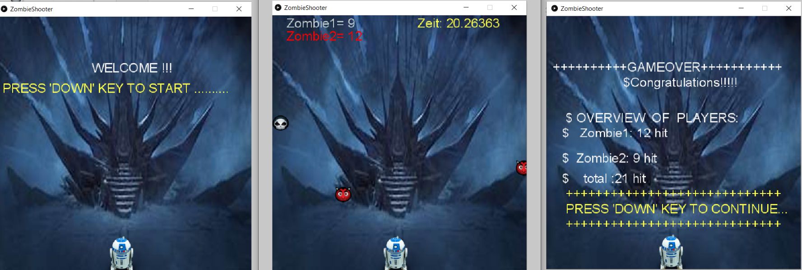

- [ZombieShooter](#ZombieShooter)
      
     - [Kurzbeschreibung](#Kurzbeschreibung)
     
     - [Screenshot](#Screenshot)
     
     - [Bedienungshinweise](#Bedienungshinweise)
     
     - [Dateiübersicht und Lines of Code](#Dateiübersicht-und-Lines-of-Code)
     
     - [Verwendete Quellen](#Verwendete-Quellen)
     
     
# ZombieShooter (PiS, SoSe2021)

Autor: Loic Maxwell Tchiabe Ngouabe

## Kurzbeschreibung

     Für mein Projekt habe ich ein Spiel entworfen, dessen
     Name „Zombie Shooter“ lautet.
     Das Spiel besteht aus zwei Zombie (Gegner),die von oben 
     nach unten fallen sollen und der Spieler selbst, der mit Hilfe von einer Waffe
     versuchen soll, den Gegner zu schießen. 
     Die Logik des Spiels besteht darin:  wenn sich ein Kollision zwischen Zombie (Gegner) und der 
     Ball entsteht,dann hört man ein hit-sound und entsprechend  erhöht sich die Anzahl von getroffenen Zombie
     ,also Wenn nicht oder die Zeit abgelaufen ist ,Dann ist das Spiel fertig „Game Over“. 
     Um das Spiel zu gewinnen , muss mindenstens 10 Zombie getroffen werden, 
     also wenn der Fall(gewonnen) ist , wird  eine Darstellung  mit " Congratulation mit Anzahl der getroffene Zombie " gezeigt.
     wenn nicht "Bad player". (122 wörter)

## Screenshot

## Bedienungshinweise

Stellen sie sicher, dass die Maus auf das Spielfeld steht und klicken sie darauf , 
um die gute Funktionalität des Spiels zu sichern. 
Das Spiel wird mit dem Betätigen der **Pfeiltaste (down)** gestartet. 
Der Spieler benutzt die **Maus** , um sich links oder rechts zu bewegen. 
Um einen Schuss abzufeuern, drücken sie die **Leertaste** in die gewünschte Schussrichtung in Spielfeld, 
bei jede Kollision erhöht sich die Anzahl von getroffenen Zombie.
Also wenn das Spiel beendet ist , kann man das Spiel **fortführen** ,in dem man die **pfeiltaste (Down)** drückt.

## Dateiübersicht und Lines of Code

~~~
 
\build.gradle
\core.jar
\javamp3-1.0.4.jar
\jsyn-20171016.jar
\README.md
\Screenshot.png
\sound.jar
\src\main\java\PisProjekt\App.java
\src\main\java\PisProjekt\Background.java
\src\main\java\PisProjekt\GameEngine.java
\src\main\java\PisProjekt\Interface.java
\src\main\java\PisProjekt\Spieler.java
\src\main\java\PisProjekt\ZombieShooter.java
\src\main\java\PisProjekt\Zombie_1.java
\src\main\java\PisProjekt\Zombie_2.java
\src\main\resources\backgrund2.png
\src\main\resources\Diablo-icon.png
\src\main\resources\explosion.mp3
\src\main\resources\Grim-Reaper-icon.png
\src\main\resources\R2D2-icon (1).png
\src\main\resources\smb_world_clear.wav
\src\test\java\PisProjekt\AppTest.java
 
 -------------------------------------------------------------------------------
 Language                     files          blank        comment           code
 -------------------------------------------------------------------------------
 Java                             9            183             33            527
 HTML                             3              0              0            392
 XML                              5              0              0            246
 CSS                              2             49              0            214
 JavaScript                       1             45              1            148
 Bourne Shell                     1             23             36            126
 Markdown                         1             31              0             82
 DOS Batch                        1             21              2             66
 Gradle                           2              7             21             19
 -------------------------------------------------------------------------------
 SUM:                            25            359             93           1820
 -------------------------------------------------------------------------------

~~~

## Verwendete Quellen

- [Processing](https://processing.org/reference/) (abruf 06.05.2021)

- Spielfigur:
  
  - [https://iconarchive.com/show/halloween-avatar-icons-by-hopstarter/Diablo-icon.html](https://iconarchive.com/show/halloween-avatar-icons-by-hopstarter/Diablo-icon.html) (abruf 06.05.2021)
  
  - [https://iconarchive.com/show/halloween-avatar-icons-by-hopstarter/Skull-icon.html](https://iconarchive.com/show/halloween-avatar-icons-by-hopstarter/Skull-icon.html) (abruf 06.05.2021)
  
  - [https://icon-library.com/icon/r2d2-icon-29.html](https://icon-library.com/icon/r2d2-icon-29.html) (abruf 06.05.2021)
  
  - [Background](https://cdn.slashgear.com/wp-content/uploads/2020/04/star-wars-backgrounds-24.jpg) (abruf 06.05.2021)
 
 - Sounds:
 
   - [https://www.salamisound.de/3634343-sfx-explosion-treffer-9](https://www.salamisound.de/3634343-sfx-explosion-treffer-9) (abruf 06.05.2021)
   
   - [https://themushroomkingdom.net/media/smb/wav](https://themushroomkingdom.net/media/smb/wav) (abruf 06.05.2021)
   
